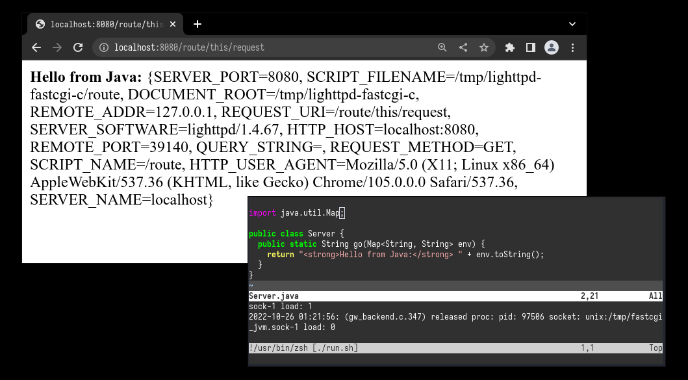

# jvm-fastcgi

This repository contains a hacky way to create a Java based web application using FastCGI (with lighttpd).

The FastCGI process creates a JVM instance that loads the java `Server` class and invokes its `go` method, passing
various environment variables from lighttpd as a `Map<String, String>`.

----

